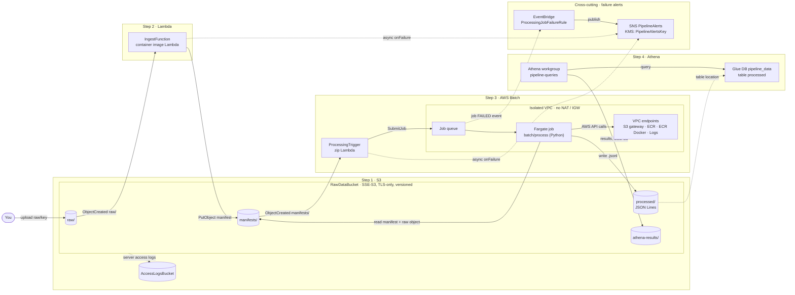

# AWS CDK Constructs Masterclass

[](https://github.com/EduardoTayupanta/aws-cdk-constructs-masterclass/actions/workflows/ci.yml)

A hands-on, **living** deep dive into AWS CDK constructs — what they are,
why they come in levels (L1 / L2 / L3), and how to use them to build a real
architecture incrementally, one construct at a time.

This repository is written to accompany a documentation series for the
[AWS Community Builders](https://aws.amazon.com/developer/community/community-builders/)
program. Content is added step by step rather than all at once, so the
`main` branch reflects the current state of the series, not a finished demo.

## Why This Repo Exists

Most CDK tutorials show a single isolated example. This project instead
builds **one small, real data pipeline incrementally**, adding a new AWS
service — and a new construct-level concept — at each step:

```
S3  →  Lambda  →  AWS Batch (Python)  →  Athena
```

| Step | Service | Status | Focus |
|------|---------|--------|-------|
| 0 | — | ✅ Done | [Understanding Constructs & Why They Have Levels](docs/00-cdk-constructs-and-levels.md) |
| 1 | S3 | ✅ Done | [Foundational L2 usage, verified with cdk-nag](docs/01-s3-foundations.md) |
| 2 | Lambda | ✅ Done | [Reacting to S3 events; cdk-nag's first real trade-offs](docs/02-lambda-ingest.md) |
| 3 | AWS Batch | ✅ Done | [Fargate, VPC endpoints, and why EventBridge's Batch target isn't enough alone](docs/03-batch-processing.md) |
| 4 | Athena | ✅ Done | [Glue Data Catalog + Athena over processed/, with no L2 to reach for](docs/04-athena-glue.md) |

## Architecture

Everything lives in one stack (`DataPipelineStack`): you upload a file under
`raw/`, each step reacts to the previous step's output through prefixes of
the same bucket, and every failure path ends on one shared, encrypted SNS
topic. Solid arrows are the data path; dotted arrows are logs, catalog
references, and failure signals.



## Tech Stack

- **Infrastructure as Code:** AWS CDK, written in **TypeScript**.
- **Application/job code:** **Python** is used only where it naturally
  belongs — for example, inside the AWS Batch job's container image — never
  as an alternative CDK language.
- **Security & compliance checks:** [`cdk-nag`](https://github.com/cdklabs/cdk-nag)
  is applied to every stack in this repo, starting with the Step 1 scaffold.
- **Docker:** required to actually deploy (`cdk deploy`) from Step 2
  onward, since `IngestFunction` and the Step 3 Batch job (`batch/process/`)
  are both packaged as container images — but *not* for `npm run build`,
  `npm test`, or `cdk synth`. A Docker-compatible builder such as Finch or
  Podman also works, via `CDK_DOCKER`. See
  [docs/02-lambda-ingest.md](docs/02-lambda-ingest.md) for the details.

## Security & Compliance: cdk-nag

Every stack in this repo is validated with **cdk-nag** — a set of rule
packs (this project uses [AWS Solutions](https://github.com/cdklabs/cdk-nag/blob/main/RULES.md))
that check the construct tree for violations such as unencrypted buckets,
overly permissive IAM policies, or missing access logging *before* the
stack is ever deployed.

It's registered once, at the `App` level in [`bin/app.ts`](bin/app.ts), via
CDK's native `Validations` API (the cdk-nag 3.x way — see
[the Step 1 article](docs/01-s3-foundations.md#the-api-changed-under-our-feet-cdk-nag-3x)
for what changed from the older `Aspects`-based pattern):

```ts
import { Validations } from 'aws-cdk-lib/core';
import { AwsSolutionsChecks } from 'cdk-nag';

Validations.of(app).addPlugins(new AwsSolutionsChecks(app, { verbose: true }));
```

Any violation that is a deliberate, documented trade-off (rather than an
oversight) is acknowledged explicitly with `Validations.of(construct).acknowledge({ id, reason })`
and a comment explaining *why* — suppressions are never silent. Each
pipeline step's article calls out any suppressions it introduces (Step 1
ships with none — see the article for why).

## Construct ID Conventions

This project is one single, growing `DataPipelineStack` — every step adds
more constructs to the *same* tree, so ID collisions become more likely
over time than in a repo full of small, disposable stacks. The rules below
apply to every construct added from Step 1 onward, and are based on the
[AWS CDK Design Guidelines](https://github.com/aws/aws-cdk/blob/main/docs/DESIGN_GUIDELINES.md#construct-ids):

1. **IDs only need to be unique among siblings, not across the whole
   stack.** CDK enforces this automatically — defining two children with
   the same ID under the same scope fails at synth time. The rules below
   are about human readability and long-term stability, not about working
   around a limitation CDK doesn't actually have.
2. **PascalCase, and name the construct's *role*, not its AWS type.**
   Prefer `RawDataBucket` over `Bucket1` or `S3Bucket`. A role-based name
   is very unlikely to collide with the next step's constructs, since each
   pipeline stage does a different job.
3. **Don't stutter the parent's name into the child's ID.** Inside
   `RawDataBucket` (a `DataLakeBucket`), children are `Bucket` and
   `AccessLogsBucket` — not `RawDataBucketBucket`. The full, unique
   identity already comes from the construct *path* (`RawDataBucket/Bucket`),
   not from repeating context in every segment.
4. **Use the ID `Resource` for a construct's single primary wrapped
   resource** — this is CDK's own internal convention (it's why
   `.node.defaultChild` works predictably on built-in L2s). It only
   applies when a construct wraps exactly *one* resource 1:1. `DataLakeBucket`
   deliberately does **not** use it: it owns two co-equal buckets, so both
   get an explicit, descriptive ID instead.
5. **Never concatenate strings to force uniqueness in a loop.** If a
   future step needs several similar resources (e.g. multiple Batch job
   definitions), create an intermediate `Construct` to act as a namespace,
   per the CDK guideline's own example, rather than building IDs like
   `Job-${name}`.
6. **Treat existing IDs as stable once shipped.** A construct ID feeds
   into the generated CloudFormation logical ID; renaming one after a real
   deployment replaces the underlying resource. Get the name right before
   merging, not after.

**Top-level IDs already used in `DataPipelineStack`** (each pipeline step
appends to this list so the next one can pick a non-colliding, on-theme
name at a glance):

| ID | Step | Construct |
|----|------|-----------|
| `RawDataBucket` | 1 (S3) | `DataLakeBucket` |
| `IngestFunction` | 2 (Lambda) | `IngestFunction` |
| `ProcessingJob` | 3 (AWS Batch) | `ProcessingJob` |
| `ProcessingTrigger` | 3 (AWS Batch) | `ProcessingTrigger` |
| `QueryCatalog` | 4 (Athena) | `QueryCatalog` |
| `PipelineAlertsKey` | Cross-cutting (failure alerts) | `Key` (aws-kms) |
| `PipelineAlerts` | Cross-cutting (failure alerts) | `Topic` (aws-sns) |
| `ProcessingJobFailureRule` | Cross-cutting (failure alerts) | `Rule` (aws-events) |

## Documentation

- [`docs/00-cdk-constructs-and-levels.md`](docs/00-cdk-constructs-and-levels.md) —
  What constructs are and why AWS organizes them into L1, L2, and L3.
- [`docs/01-s3-foundations.md`](docs/01-s3-foundations.md) —
  Building the `DataLakeBucket` L2 construct and verifying it with cdk-nag.
- [`docs/02-lambda-ingest.md`](docs/02-lambda-ingest.md) —
  Wiring Lambda to S3 events and cdk-nag's first genuinely justified
  suppressions.
- [`docs/03-batch-processing.md`](docs/03-batch-processing.md) —
  AWS Batch on Fargate, VPC endpoints instead of a NAT Gateway, and why
  EventBridge's native Batch target can't carry a triggering object's key.
- [`docs/04-athena-glue.md`](docs/04-athena-glue.md) —
  Glue Data Catalog + Athena over `processed/`, hand-composing L1s where
  `aws-cdk-lib` has no L2, and why there's deliberately no Glue Crawler.

More articles are added as each pipeline step is built.

## Prerequisites

To build, test, and synthesize locally:

- **Node.js 22.13 or later** (with **npm**, which ships with it). Node 20 is the
  floor `aws-cdk-lib` itself accepts, but it's past end-of-life, and 22 is
  the runtime this repo's Lambda code actually targets
  (`public.ecr.aws/lambda/nodejs:22`, `esbuild --target=node22`).
- **Python 3.9+** — *only* to run the Batch job's own unit tests in
  `batch/process/` (see [Running the Tests](#running-the-tests)). The CDK app
  itself never needs Python.

Additionally, to actually deploy (`cdk deploy`):

- **An AWS account** you're allowed to create resources in.
- **[AWS CLI v2](https://docs.aws.amazon.com/cli/latest/userguide/getting-started-install.html)
  with credentials configured** (e.g. `aws configure` or `aws configure sso`).
  `aws sts get-caller-identity` should print the account you expect.
- **A one-time CDK bootstrap** of the target account/region. The stack
  publishes container images and other assets into the bootstrap stack's
  S3 bucket and ECR repository, so the first `cdk deploy` fails without it:

  ```bash
  npx cdk bootstrap aws://ACCOUNT-ID/REGION
  ```

  This only has to be done once per account/region, not once per deploy.
- **Docker** (or a Docker-compatible builder such as Finch or Podman, via
  `CDK_DOCKER`) — needed by `cdk deploy` only, to build the `IngestFunction`
  and Batch job container images. `npm run build`, `npm test`, and
  `cdk synth` work without it.

> **Cost warning:** deploying creates real, billable AWS resources — notably
> the VPC interface endpoints the Batch job uses, which are billed hourly
> for as long as they exist, whether or not anything is running. Treat a
> deploy as ephemeral: when you're done, run `npx cdk destroy` *and*
> `npx cdk gc` (see [the cleanup notes](docs/02-lambda-ingest.md#cleanup-cdk-destroy-isnt-the-whole-story-anymore)
> and the VPC endpoint cost notes in [docs/03-batch-processing.md](docs/03-batch-processing.md)).

## Getting Started

```bash
npm install
npm --prefix lambda/ingest install   # the ingest Lambda's own, independent sub-project
npm run build   # type-check the project (CDK app + the ingest Lambda's own sub-project)
npm test        # run the Jest suite, including the cdk-nag check
npx cdk synth   # synthesize the CloudFormation template — no Docker needed
npx cdk bootstrap aws://ACCOUNT-ID/REGION  # one-time per account/region, before the first deploy
npx cdk deploy  # actually deploy — this is the step that needs Docker
npx cdk destroy # tear down this stack's resources
npx cdk gc      # also reclaim assets (e.g. the container images) no stack references anymore
```

## Running the Tests

The repo has three independent test suites — each component keeps its own
toolchain, so each one is installed and run on its own. CI runs all three on
every push and pull request.

### 1. CDK app (root): constructs, stack, cdk-nag, processing-trigger Lambda

```bash
npm install
npm test
```

Runs the Jest suite under `test/`: unit tests for every construct in
`test/constructs/`, the full stack test in `test/data-pipeline-stack.test.ts`
(which also applies the cdk-nag AWS Solutions checks and fails on any
unacknowledged finding), and the processing-trigger Lambda handler tests in
`test/lambda/`. No Docker or AWS credentials needed.

### 2. Ingest Lambda (`lambda/ingest/`)

The ingest handler is its own npm sub-project with its own `package.json`,
`jest.config.js`, and dependencies:

```bash
npm --prefix lambda/ingest ci     # first time only (or after its package-lock.json changes)
npm --prefix lambda/ingest test
npm --prefix lambda/ingest test -- --coverage   # optional: with a coverage report
```

### 3. Batch processing job (`batch/process/`, Python)

```bash
cd batch/process
python3 -m venv .venv
source .venv/bin/activate
pip install -r requirements-dev.txt
pytest --cov=process --cov-report=term-missing
deactivate
```

`.venv/`, `.pytest_cache/`, `__pycache__/`, and `.coverage` are all
gitignored, so creating them inside `batch/process/` is fine.

`requirements-dev.txt` is deliberately separate from `requirements.txt`:

- **`requirements.txt`** pins the exact boto3/botocore/urllib3 versions for
  the job's `python:3.13-slim` container image, and is the only file
  installed into it.
- **`requirements-dev.txt`** is for local testing only (pytest, pytest-cov, and
  a loosely ranged boto3). The production pins may not install on your
  machine's Python (urllib3 2.x needs Python 3.10+), and the tests mock every
  boto3 call, so any working boto3 is enough.

## Try It End to End

Run this after `npx cdk deploy` succeeds. The stack has no fixed environment,
so every command below uses your AWS CLI's default region — add `--region`
everywhere if you deployed somewhere else.

### 1. Get the stack outputs

```bash
STACK=DataPipelineStack

BUCKET=$(aws cloudformation describe-stacks --stack-name "$STACK" \
  --query "Stacks[0].Outputs[?OutputKey=='RawDataBucketName'].OutputValue" --output text)
WORKGROUP=$(aws cloudformation describe-stacks --stack-name "$STACK" \
  --query "Stacks[0].Outputs[?OutputKey=='AthenaWorkGroupName'].OutputValue" --output text)
JOB_QUEUE=$(aws cloudformation describe-stacks --stack-name "$STACK" \
  --query "Stacks[0].Outputs[?OutputKey=='ProcessingJobQueueArn'].OutputValue" --output text)

echo "$BUCKET  $WORKGROUP  $JOB_QUEUE"
# The table is the GlueTableName output: pipeline_data.processed
```

### 2. Upload the sample under `raw/`

The pipeline only reacts to keys under `raw/`. [`samples/raw/orders.json`](samples/raw/orders.json)
is a JSON array, and the Batch job turns it into one JSON Lines row per element.

```bash
aws s3 cp samples/raw/orders.json "s3://$BUCKET/raw/orders.json"
```

That single upload sets off this chain:

| Stage | Written by | Key |
|---|---|---|
| Raw input | you | `raw/orders.json` |
| Manifest | `IngestFunction` | `manifests/orders.json.json` |
| Processed output | Batch job `process-manifest` | `processed/orders.json.jsonl` |

### 3. Watch it move through the pipeline

CDK generates the log group names, so look them up from the stack:

```bash
log_group() {
  aws cloudformation describe-stack-resources --stack-name "$STACK" \
    --query "StackResources[?starts_with(LogicalResourceId, '$1')].PhysicalResourceId" --output text
}
INGEST_LOGS=$(log_group IngestFunctionLogGroup)
TRIGGER_LOGS=$(log_group ProcessingTriggerLogGroup)
JOB_LOGS=$(log_group ProcessingJobLogGroup)
```

Then check each stage:

```bash
# IngestFunction: look for "Recording manifest"
aws logs tail "$INGEST_LOGS" --since 15m

# The manifest it wrote
aws s3 cp "s3://$BUCKET/manifests/orders.json.json" -

# ProcessingTrigger: look for "Submitting processing job"
aws logs tail "$TRIGGER_LOGS" --since 15m

# Batch job status (SUBMITTED -> RUNNABLE -> STARTING -> RUNNING -> SUCCEEDED)
aws batch list-jobs --job-queue "$JOB_QUEUE" \
  --filters name=JOB_NAME,values=process-manifest \
  --query 'jobSummaryList[].[jobId,status,statusReason]' --output table

# The job's own output (Reading manifest... / Writing s3://.../processed/orders.json.jsonl)
aws logs tail "$JOB_LOGS" --since 15m --follow
```

Expect a few minutes between submission and `SUCCEEDED` while Fargate
provisions a task. Then check the processed output:

```bash
aws s3 ls "s3://$BUCKET/processed/"
aws s3 cp "s3://$BUCKET/processed/orders.json.jsonl" -
```

If the job ends up `FAILED` after its retries, the `PipelineAlerts` SNS topic
gets a notification, and the job log group above has the traceback.

### 4. Query it with Athena

The `pipeline_data.processed` table has a single `line` string column holding
one whole JSON line per row — pull fields out with `json_extract_scalar`. The
`pipeline-queries` workgroup enforces its own result location
(`athena-results/` in the same bucket), so no `--result-configuration` is needed.

```bash
QID=$(aws athena start-query-execution \
  --work-group "$WORKGROUP" \
  --query-execution-context Database=pipeline_data \
  --query-string "
    SELECT
      json_extract_scalar(line, '$.customer') AS customer,
      count(*) AS orders,
      sum(CAST(json_extract_scalar(line, '$.quantity')  AS integer)
        * CAST(json_extract_scalar(line, '$.unitPrice') AS double)) AS total_spent
    FROM processed
    WHERE json_extract_scalar(line, '$.orderId') IS NOT NULL
    GROUP BY 1
    ORDER BY total_spent DESC" \
  --query QueryExecutionId --output text)

# Wait for the query to finish
until STATE=$(aws athena get-query-execution --query-execution-id "$QID" \
        --query QueryExecution.Status.State --output text) \
      && [[ "$STATE" != QUEUED && "$STATE" != RUNNING ]]; do sleep 2; done
echo "$STATE"   # SUCCEEDED (if FAILED, check QueryExecution.Status.StateChangeReason)

aws athena get-query-results --query-execution-id "$QID" \
  --query 'ResultSet.Rows[].Data[].VarCharValue' --output text
```

Expected (after the header row): `ana` 2 orders ≈ 238.90, `bruno` 2 ≈ 98.99,
`carla` 1 ≈ 36.75. To see the raw rows instead: `SELECT line FROM processed LIMIT 10`.

### 5. Tear it down

Every resource in this stack uses a demo `DESTROY` removal policy: the bucket
empties itself (including `processed/` and `athena-results/`) and the Athena
workgroup is deleted even with query history. This stops the ongoing costs
(VPC endpoints, KMS key, logs):

```bash
npx cdk destroy
npx cdk gc   # also reclaim the container images left in the bootstrap assets
```

## Repository Structure (evolving)

```
aws-cdk-constructs-masterclass/
├── .github/workflows/ci.yml             # CI: build, all three test suites, cdk synth
├── bin/app.ts                          # CDK app entry point (registers cdk-nag)
├── lib/
│   ├── data-pipeline-stack.ts          # The single, growing pipeline stack
│   └── constructs/
│       ├── data-lake-bucket.ts         # Step 1: the S3 L2 construct
│       ├── ingest-function.ts          # Step 2: the Lambda L2 construct
│       ├── processing-job.ts           # Step 3: VPC + Batch (Fargate) L2 composition
│       ├── processing-trigger.ts       # Step 3: the Zip Lambda that submits Batch jobs
│       └── query-catalog.ts            # Step 4: Glue Database/Table + Athena WorkGroup (L1s, no L2 exists)
├── lambda/
│   ├── ingest/                          # Step 2: self-contained container-image Lambda
│   │   ├── index.ts                     #   handler code
│   │   ├── Dockerfile                   #   two-stage build: esbuild, then AWS's Lambda base image
│   │   └── package.json                 #   its own deps, independent of the CDK app's
│   └── processing-trigger/              # Step 3: Zip Lambda, bundled by the CDK app itself
│       └── index.ts                     #   handler code (no separate sub-project needed)
├── batch/
│   └── process/                         # Step 3: self-contained container-image Batch job
│       ├── process.py                   #   raw/ -> processed/ (JSON Lines) transform
│       ├── Dockerfile                   #   plain Python base image
│       ├── requirements.txt             #   its own pinned deps (boto3), installed into the image
│       └── requirements-dev.txt         #   local test deps only (pytest), never in the image
├── samples/raw/orders.json              # Sample input for the end-to-end walkthrough
├── test/                                # Jest + CDK assertions + cdk-nag checks
├── docs/                                # Written articles for the Community Builder series
├── LICENSE                              # MIT
└── README.md
```

## License

MIT
